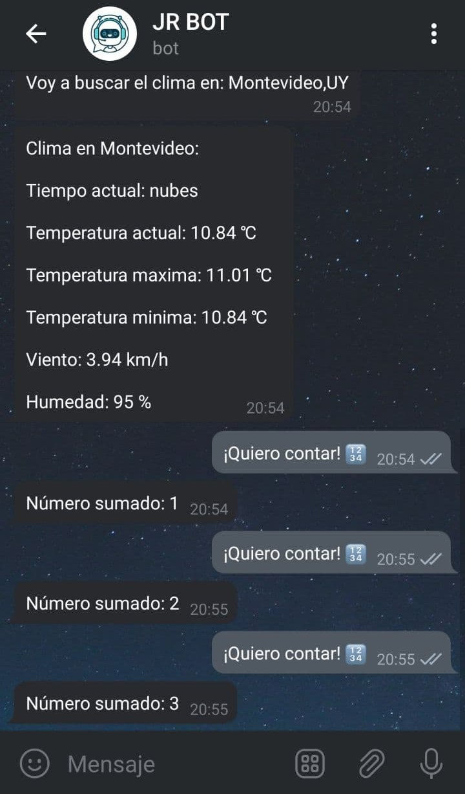

# bot-telegram-node

Bot hecho en NodeJS que permite saber el clima de una ciudad y sumar un número.

Comando inicial para instalar modulos NodeJS:

```
npm install
```

Comando para iniciar servidor:

```
nodemon server
```

  
